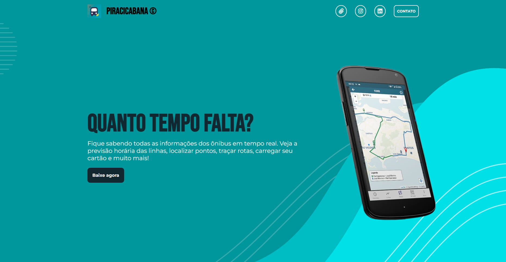

<h1 align="center"> Landing page App Quanto Tempo Falta </h1>

  <a href="#-tecnologias">Tecnologias</a>&nbsp;&nbsp;&nbsp;|&nbsp;&nbsp;&nbsp;
  <a href="#-projeto">Projeto</a>&nbsp;&nbsp;&nbsp;|&nbsp;&nbsp;&nbsp;
  <a href="#memo-licença">Licença</a>

  

 

  

## 🚀 Tecnologias

Esse projeto foi desenvolvido com as seguintes tecnologias:

- HTML e CSS
- JavaScript
- Git e Github

## 💻 Projeto

A Landing page do App Quanto Tempo Falta é uma página de apresentação e divigulgação do aplicativo rastreador de linhas de ônibus "Quanto tempo falta" da empresa Piracicabana. Contém algumas informações e links importantes tal como o link de download.

 - [Visite o projeto online](https://luishdev.github.io/LandingPage-App-Quanto-Tempo-Falta/)

## :memo: Licença

Esse projeto está sob a licença MIT.

---

Feito com ♥ by LuisHdev :wave: [Acesse meu linkedin!](linkedin.com/in/luis-henrique-a5a086250/)
